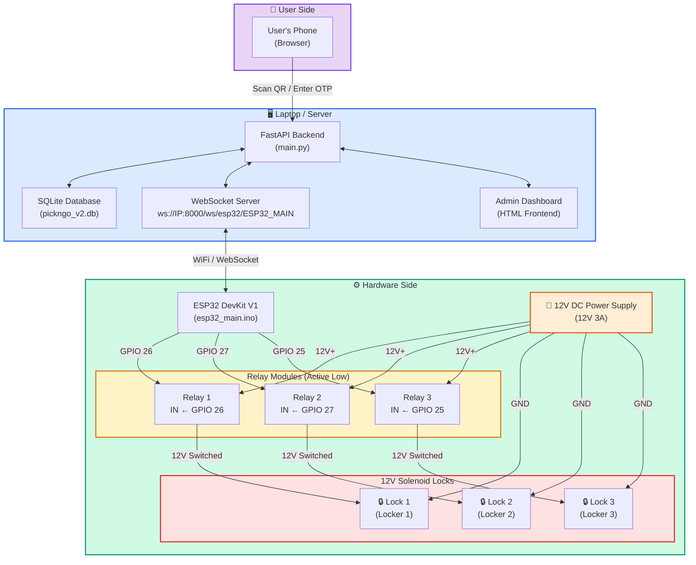
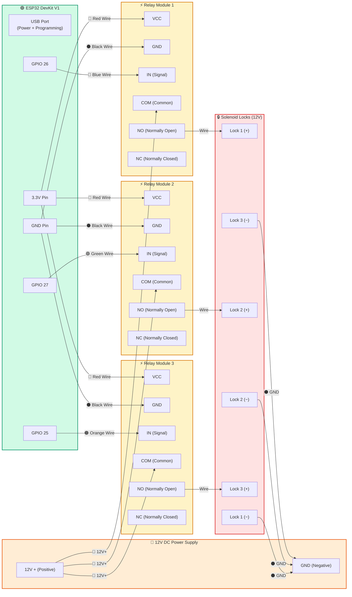
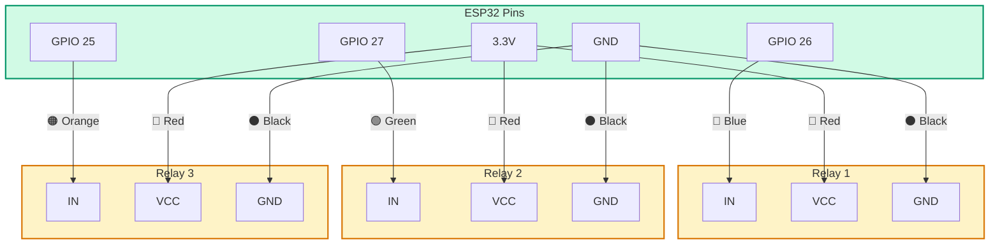
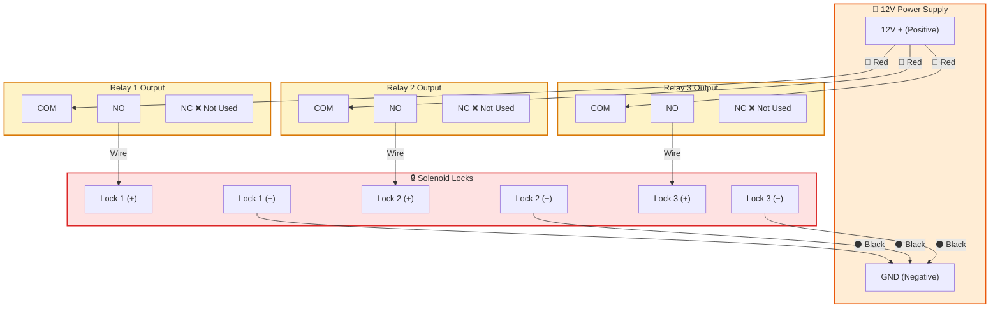
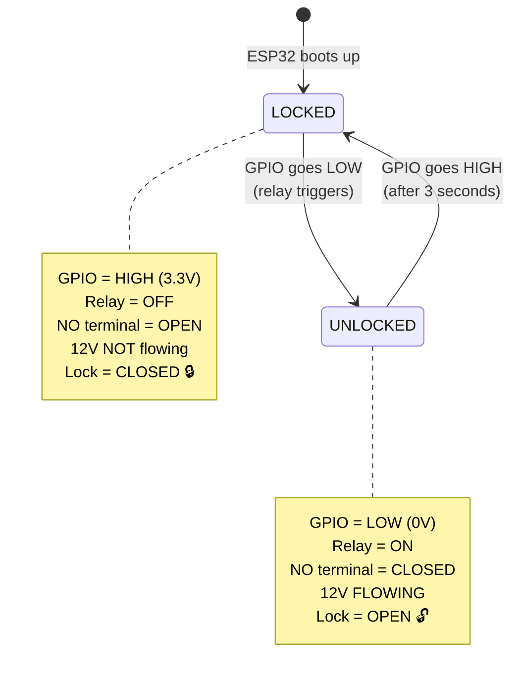
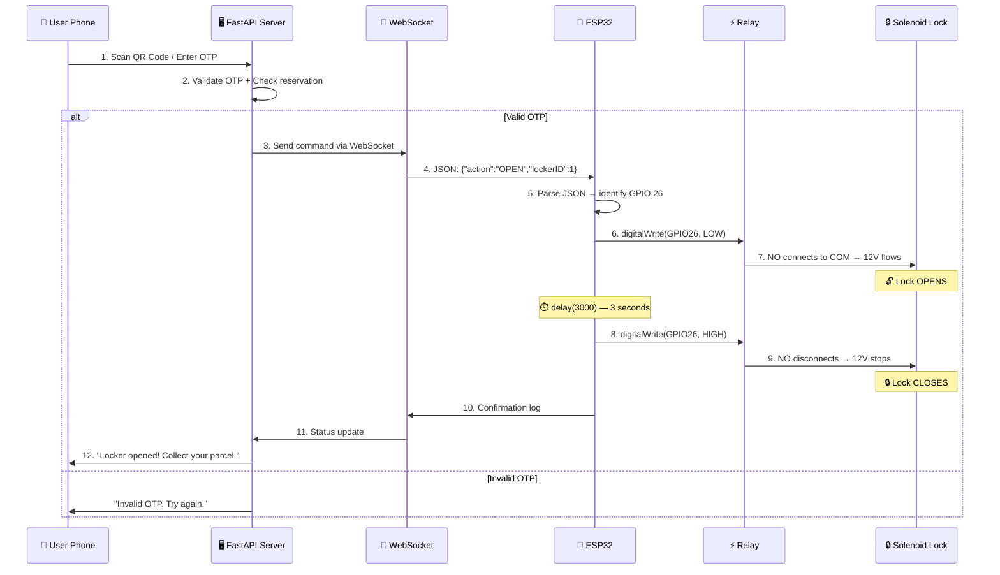
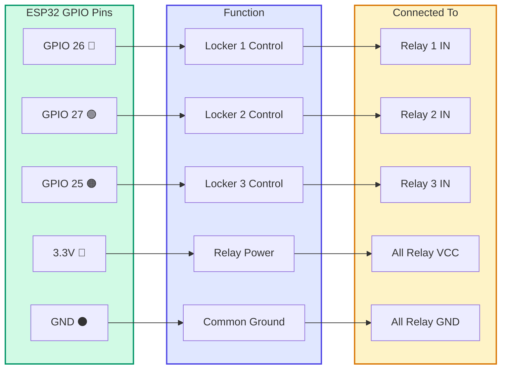
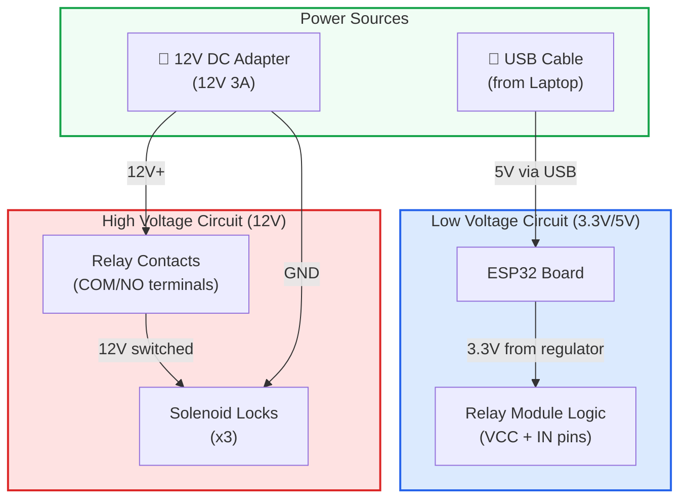
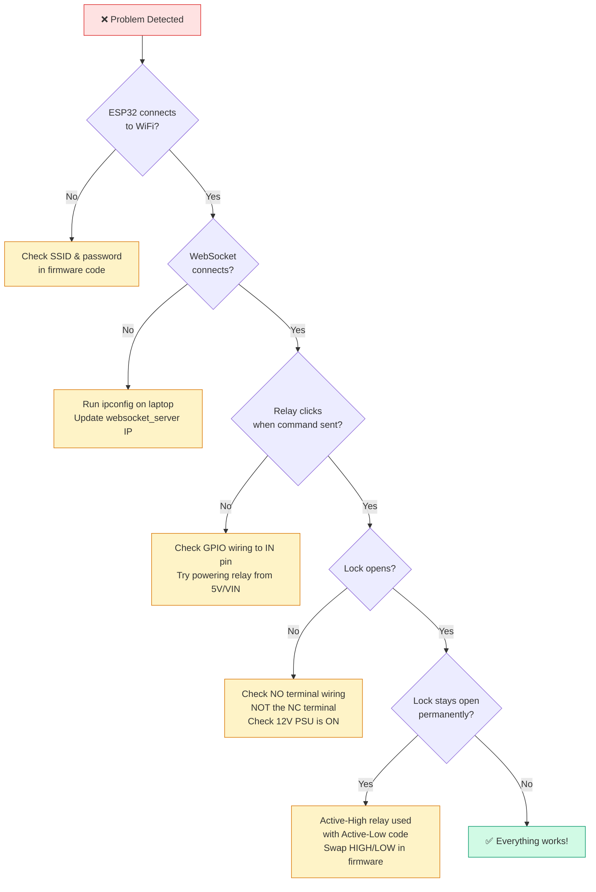

# 🔌 Smart Parcel Locker (PickNGo) — Wiring Diagram & Hardware Guide

---

## 1. System Architecture Overview

This diagram shows how all major components in the PickNGo system communicate with each other.



### Explanation

The system has **3 layers**:

1. **User Side** — The customer uses their phone browser to scan a QR code or enter an OTP to collect their parcel.
2. **Server Side** — A FastAPI Python backend runs on a laptop. It handles authentication, parcel management, and sends unlock commands via **WebSocket** to the ESP32.
3. **Hardware Side** — The ESP32 microcontroller receives the WebSocket command over WiFi, then triggers the correct relay module which switches the 12V circuit to open the solenoid lock for 20 seconds.

---

## 2. Complete Wiring Diagram

This is the full electrical wiring diagram showing every connection.



### Explanation

The wiring is split into **two electrically isolated circuits**:

| Circuit | Voltage | Purpose |
|---------|---------|---------|
| **Signal Side** (Low Voltage) | 3.3V from ESP32 | Controls the relay coils via GPIO pins. The ESP32 sends a LOW/HIGH signal to tell the relay to switch ON/OFF. |
| **Load Side** (High Voltage) | 12V from external PSU | Powers the solenoid locks. The relay acts as an electrically-controlled switch that connects or disconnects the 12V supply to each lock. |

> **Why two separate power sources?** The ESP32 operates at 3.3V and cannot directly power a 12V solenoid. The relay module bridges the gap — a tiny 3.3V signal from the ESP32 controls a mechanical switch that handles the 12V power for the lock. The optocoupler inside the relay keeps the two circuits electrically isolated, protecting the ESP32 from damage.

---

## 3. Signal Side Wiring (ESP32 → Relay Modules)



### Explanation — What Each Wire Does

| Wire | From | To | Purpose |
|------|------|----|---------|
| 🔵 Blue | GPIO 26 | Relay 1 IN | **Control signal** for Locker 1. When ESP32 sets this pin LOW, Relay 1 activates and opens Lock 1. |
| 🟢 Green | GPIO 27 | Relay 2 IN | **Control signal** for Locker 2. Same logic as above. |
| 🟠 Orange | GPIO 25 | Relay 3 IN | **Control signal** for Locker 3. Same logic as above. |
| 🔴 Red | 3.3V | All Relay VCC | **Power** for the relay module's logic circuitry (LED indicator + optocoupler). |
| ⚫ Black | GND | All Relay GND | **Common ground** — completes the circuit between ESP32 and relay modules. Without this, no current flows and nothing works. |

---

## 4. Load Side Wiring (Relay Modules → Solenoid Locks)



### Explanation — COM, NO, NC

Every relay module has **3 output terminals**:

| Terminal | Full Name | Meaning |
|----------|-----------|---------|
| **COM** | Common | The "input" of the switch. Always connect your power source (12V+) here. |
| **NO** | Normally Open | Disconnected from COM by default. When relay activates, NO connects to COM → circuit closes → lock opens. **We use this one.** |
| **NC** | Normally Closed | Connected to COM by default. We do NOT use this because we want the lock to stay LOCKED when the relay is off. |

> **Why NO and not NC?** Using the **Normally Open** terminal means that when the ESP32 is OFF, rebooting, or loses power, the circuit to the solenoid is **broken** and the lock stays **closed/locked**. This is a **fail-secure** design — if anything goes wrong, the locker stays locked.

---

## 5. Active-Low Relay Logic Explained



### Explanation — Why "Active Low"?

Most common relay modules sold online are **Active Low**, meaning:

- Sending **LOW (0V)** to the IN pin → **activates** the relay (turns it ON)
- Sending **HIGH (3.3V)** to the IN pin → **deactivates** the relay (turns it OFF)

This seems backwards, but it's because of how the relay module's **optocoupler** is wired internally. The LED inside the optocoupler turns ON when current flows from VCC through the LED to the IN pin — which happens when IN is pulled LOW.

**In the firmware (`esp32_main.ino`):**

```cpp
// At boot: Set all pins HIGH = all relays OFF = all locks CLOSED
digitalWrite(SOLENOID_PIN_1, HIGH);  // Lock 1 → LOCKED
digitalWrite(SOLENOID_PIN_2, HIGH);  // Lock 2 → LOCKED
digitalWrite(SOLENOID_PIN_3, HIGH);  // Lock 3 → LOCKED

// To open a lock: Set pin LOW = relay ON = lock OPENS
digitalWrite(pinToTrigger, LOW);     // Relay triggers → Lock OPENS
delay(3000);                         // Wait 3 seconds
digitalWrite(pinToTrigger, HIGH);    // Relay releases → Lock CLOSES
```

---

## 6. Signal Flow — From QR Scan to Lock Open



### Explanation — Step by Step

1. **User scans QR code** — The QR code on the locker contains a URL that opens the pickup page in the user's phone browser.
2. **Server validates** — The FastAPI backend checks the OTP and reservation status in the SQLite database.
3. **WebSocket command sent** — If valid, the server sends a JSON message through the persistent WebSocket connection to the ESP32.
4. **ESP32 receives JSON** — The ESP32 parses the JSON using ArduinoJson library and extracts the `action` and `lockerID`.
5. **GPIO pin identified** — Based on `lockerID`, the firmware maps to the correct pin (1→GPIO26, 2→GPIO27, 3→GPIO25).
6. **Relay triggered** — The GPIO pin is set LOW, which activates the Active-Low relay.
7. **Lock opens** — The relay's internal switch connects COM to NO, completing the 12V circuit to the solenoid, which retracts the lock bolt.
8. **3-second delay** — The firmware waits 3000ms to give the user time to open the locker door.
9. **Lock closes** — GPIO goes HIGH, relay deactivates, 12V circuit breaks, solenoid spring pushes the bolt back into locked position.

---

## 7. Pin Mapping Summary



---

## 8. Power Supply Layout



### Explanation — Two Separate Power Rails

| Power Source | Voltage | What It Powers | Why |
|-------------|---------|----------------|-----|
| **USB Cable** (laptop) | 5V → 3.3V (via ESP32's onboard regulator) | ESP32 chip + Relay module logic (VCC, LEDs, optocoupler) | Low power components only need 3.3V. USB provides enough current. |
| **12V DC Adapter** | 12V | Solenoid locks (through relay NO contacts) | Solenoid locks require 12V to generate enough electromagnetic force to retract the bolt. ESP32 cannot supply this. |

> **⚠️ IMPORTANT:** These two circuits must NEVER be directly connected. The relay's optocoupler provides electrical isolation between them. Connecting 12V to any ESP32 pin will permanently destroy the board.

> **💡 TIP for standalone use:** If you want to run without a laptop (standalone), use a 12V-to-5V buck converter. Connect the 12V PSU to the buck converter input, then connect the 5V output to the ESP32's **VIN** pin. This lets a single 12V supply power everything.

---

## 9. ESP32 Pinout Reference

```
                      ┌─────────────────┐
                      │    ESP32 DevKit  │
                      │     (Top View)   │
                      │    ┌───────┐     │
                EN ───┤    │  USB  │     ├─── GPIO 23
           GPIO 36 ───┤    └───────┘     ├─── GPIO 22
           GPIO 39 ───┤                  ├─── GPIO 01 (TX)
           GPIO 34 ───┤                  ├─── GPIO 03 (RX)
           GPIO 35 ───┤                  ├─── GPIO 21
           GPIO 32 ───┤                  ├─── GPIO 19
           GPIO 33 ───┤                  ├─── GPIO 18
    ★ ──── GPIO 25 ───┤  (Locker 3)     ├─── GPIO 05
    ★ ──── GPIO 26 ───┤  (Locker 1)     ├─── GPIO 17
    ★ ──── GPIO 27 ───┤  (Locker 2)     ├─── GPIO 16
           GPIO 14 ───┤                  ├─── GPIO 04
           GPIO 12 ───┤                  ├─── GPIO 02
           GPIO 13 ───┤                  ├─── GPIO 15
    ★ ──── GND ───────┤                  ├─── GND
           VIN ───────┤                  ├─── 3.3V ──── ★
                      └──────────────────┘

    ★ = Pins used in this project
```

---

## 10. Bill of Materials (BOM)

| # | Component | Qty | Specification | Est. Price (MYR) |
|---|-----------|-----|---------------|------------------|
| 1 | ESP32 DevKit V1 (30-pin) | 1 | Dual-core 240MHz, WiFi + BLE | ~RM 25 |
| 2 | Relay Module (Active Low) | 3 | 1-Channel, 3.3V compatible, optocoupler isolated | ~RM 5 each |
| 3 | 12V Solenoid Lock | 3 | DC 12V electric cabinet lock, fail-secure | ~RM 15 each |
| 4 | 12V DC Power Supply | 1 | 12V 3A minimum, barrel jack or screw terminal | ~RM 20 |
| 5 | Breadboard | 1 | Full-size 830 holes | ~RM 8 |
| 6 | Jumper Wires | ~20 | Male-to-Male & Male-to-Female assorted colors | ~RM 8 |
| 7 | Micro-USB Cable | 1 | For ESP32 programming & power | ~RM 5 |
| 8 | *(Optional)* Buck Converter | 1 | 12V → 5V step-down module | ~RM 6 |

**Estimated Total: ~RM 107**

> **💡 TIP:** Buy a single **3-channel relay module** instead of 3 separate 1-channel modules. It has all 3 relays on one board, simplifying wiring. They work identically — just share VCC and GND.

---

## 11. Step-by-Step Assembly Guide

### Step 1 — Prepare the Breadboard
1. Place the **ESP32 DevKit** in the center of the breadboard, straddling the center gap.
2. Place the 3 relay modules next to the breadboard (they're usually too large to fit on the breadboard).

### Step 2 — Wire the Signal Side (Low Voltage)
1. 🔵 **Blue wire:** ESP32 **GPIO 26** → Relay 1 **IN**
2. 🟢 **Green wire:** ESP32 **GPIO 27** → Relay 2 **IN**
3. 🟠 **Orange wire:** ESP32 **GPIO 25** → Relay 3 **IN**
4. 🔴 **Red wire:** ESP32 **3.3V** → Relay 1 **VCC** → Relay 2 **VCC** → Relay 3 **VCC** (daisy-chain)
5. ⚫ **Black wire:** ESP32 **GND** → Relay 1 **GND** → Relay 2 **GND** → Relay 3 **GND** (daisy-chain)

### Step 3 — Wire the Load Side (12V)
1. 🔴 Connect **12V PSU (+)** → **COM** on Relay 1, Relay 2, and Relay 3
2. Connect Relay 1 **NO** → Solenoid Lock 1 **(+)** terminal
3. Connect Relay 2 **NO** → Solenoid Lock 2 **(+)** terminal
4. Connect Relay 3 **NO** → Solenoid Lock 3 **(+)** terminal
5. ⚫ Connect all Solenoid Lock **(−)** terminals → **12V PSU GND**

### Step 4 — Upload Firmware
1. Connect ESP32 to laptop via Micro-USB.
2. Open **Arduino IDE**.
3. Select Board: **ESP32 Dev Module**.
4. Install libraries: `WebSockets` by Markus Sattler, `ArduinoJson` by Benoit Blanchon.
5. Update WiFi credentials and server IP in `esp32_main.ino`:
   ```cpp
   const char* ssid = "YOUR_WIFI_NAME";
   const char* password = "YOUR_WIFI_PASSWORD";
   const char* websocket_server = "YOUR_LAPTOP_IP";
   ```
6. Click **Upload**.

### Step 5 — Power Up & Test
1. Connect ESP32 to laptop via USB (powers ESP32 + relays).
2. Plug in the 12V DC power supply (powers solenoids).
3. Open Arduino IDE **Serial Monitor** at **115200 baud**.
4. Verify these messages appear:
   ```
   WiFi connected
   IP address: 192.168.x.x
   [WSc] Connected to url: /ws/esp32/ESP32_MAIN
   ```
5. From the admin dashboard, trigger an unlock command and listen for the relay **click**.

---

## 12. Pre-Flight Checklist

- [ ] ESP32 connected to laptop via USB
- [ ] All 3 relay module LEDs are on (indicating VCC power)
- [ ] 12V power supply plugged in and switched ON
- [ ] WiFi SSID is broadcasting and ESP32 connects
- [ ] FastAPI server is running (`python main.py` or `start_server.bat`)
- [ ] Serial Monitor shows `WiFi connected` + WebSocket `Connected`
- [ ] Test: Send `{"action":"OPEN","lockerID":1}` — Relay 1 clicks and Lock 1 opens for 20 seconds
- [ ] Repeat test for Locker 2 and Locker 3
- [ ] All locks re-lock automatically after 20 seconds

---

## 13. Troubleshooting



| # | Problem | Likely Cause | Fix |
|---|---------|-------------|-----|
| 1 | ESP32 won't connect to WiFi | Wrong SSID/password | Update `ssid` and `password` in firmware |
| 2 | WebSocket won't connect | Wrong server IP address | Run `ipconfig`, update `websocket_server` |
| 3 | Relay doesn't click | 3.3V not enough for relay coil | Power relay VCC from ESP32 **VIN** (5V) instead of 3.3V |
| 4 | Relay clicks but lock won't open | Wire on NC instead of NO | Move wire to the **NO** (Normally Open) terminal |
| 5 | Lock opens on boot then stays open | Active-High/Low mismatch | Use `esp32_main.ino` (Active-Low), not `sketch_jun21a.ino` |
| 6 | ESP32 resets when relay triggers | Current spike from relay coil | Use separate 5V supply for relays, or add a capacitor |
| 7 | Lock opens but doesn't re-lock | Solenoid wired wrong / spring broken | Check solenoid polarity and mechanical spring |

---

## 14. Safety Warnings

> **⚠️ NEVER** connect 12V directly to any ESP32 pin — it will be permanently destroyed.

> **⚠️ NEVER** touch relay output terminals while the 12V supply is ON — risk of electric shock.

> **⚠️ ALWAYS** disconnect the 12V power supply before making any wiring changes on the load side.

> **⚠️ ALWAYS** double-check polarity before powering on. Reversed 12V can damage solenoid locks.

---

## 15. Power Control & Relays: Turning On/Off ESP32, Relay, and Solenoid

Understanding how to control power to each part of the system is essential for safety, testing, and maintenance:

### A. ESP32 Microcontroller
- **Power Source:** Supplied via the Micro-USB port (5V from the laptop or USB power adapter) or directly to the `VIN` and `GND` pins.
- **Method to Turn On/Off:** 
  - There is **no software command** to turn off power to the ESP32 chip itself.
  - To turn it off, you must **physically unplug** the USB cable or disconnect the power source.
  - For software-initiated resets, you can perform a soft reboot in firmware via `ESP.restart()`.

### B. Relay Modules
- **Control Signal:** Controlled by ESP32 GPIO pins (`GPIO 26`, `GPIO 27`, `GPIO 25`).
- **Method to Turn On/Off:**
  - Because these are **Active-Low** relays, writing `LOW` to the control pin triggers the relay coil (ON state, closed circuit).
  - Writing `HIGH` turns off the relay coil (OFF state, open circuit).
  - These commands are sent from the backend to the ESP32 via WebSockets (`{"action": "OPEN"}` or `{"action": "LOCK"}`).

### C. Solenoid Locks (12V)
- **Power Source:** Supplied by the external 12V DC power supply.
- **Method to Turn On/Off:**
  - **Indirectly via Relays (Normal Operation):** Triggering the relay via the ESP32 controls power to the solenoid. The lock will automatically turn ON (unlocked) for **20 seconds** before the relay turns OFF (re-locked).
  - **Directly (Physical Power Cut):** To turn off power to all solenoids for emergency or maintenance, **unplug the 12V DC power supply**. Without 12V, the solenoids cannot engage and the doors will remain securely locked (since they are Normally Closed).

---

*Document created for PickNGo Smart Parcel Locker System — FYP Project*  
*Firmware reference: `esp32_firmware/esp32_main.ino`*
